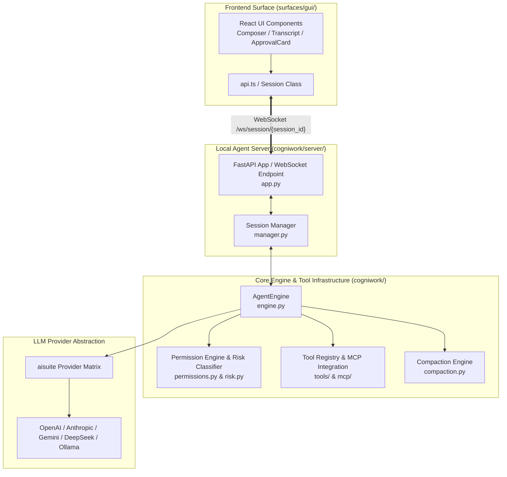
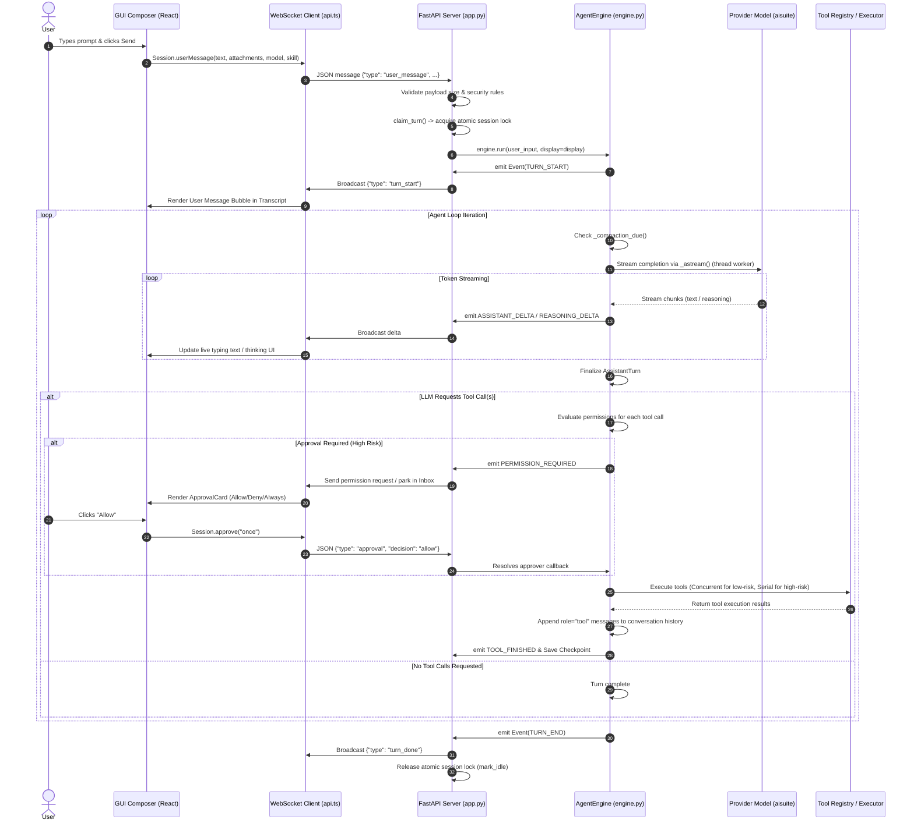
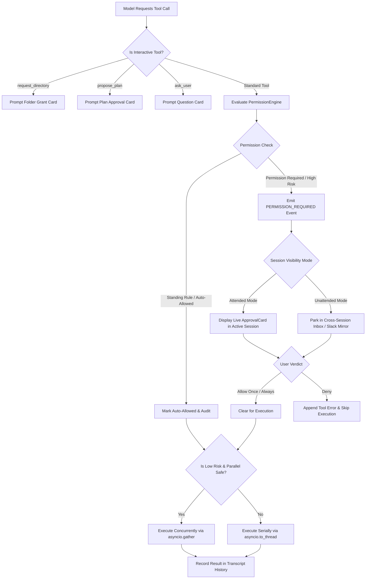

# CogniOS Chat System — Complete Architectural Illustration

This document provides an in-depth, end-to-end architectural breakdown of how the **Chat System** in CogniOS operates. It covers everything from the desktop UI user interaction to the WebSocket protocol, background agent loop execution, tool approval gates, multi-provider LLM streaming via `aisuite`, state persistence, and context compaction.

---

## 1. System Overview & Core Architecture

CogniOS uses a **local-first, event-driven desktop architecture**. The system is split into two primary layers running on the user's local machine:

1. **Frontend Surface (Desktop App / Web App)**
   - Built with **React + Vite + TypeScript**, wrapped in a **Tauri** desktop shell.
   - Communicates with the backend server over **HTTP REST** for static session data and **WebSockets** (`/ws/session/{session_id}`) for real-time bidirectional message streaming, tool approval cards, and event dispatch.
   
2. **Backend Agent Server (Python ASGI Service)**
   - Powered by **FastAPI** (`cogniwork/server/app.py` & `manager.py`).
   - Runs locally at `127.0.0.1:8765`, protected by an origin check and an in-memory loopback token (`X-CogniOS-Token`).
   - Hosts the **`AgentEngine`** (`cogniwork/engine.py`), tool execution registries, risk & permission evaluation engines, and the cross-surface Inbox manager.

---

## 2. End-to-End Chat Data Flow

When a user types a prompt into the chat bar and hits send, the execution moves through **5 distinct stages**:

---

## 3. Detailed Component Breakdown

### A. Frontend Layer (`surfaces/gui/src/`)
- **[api.ts](file:///C:/Users/91630/Desktop/cognios/surfaces/gui/src/api.ts)**: Implements the `Session` class which manages the active WebSocket connection (`/ws/session/{session_id}`). Handles Outbox queuing while connecting, message dispatch (`userMessage`, `approve`, `respondDirectory`, `respondPlan`, `respondQuestion`, `interrupt`, `retry`), and incoming event routing.
- **[Composer.tsx](file:///C:/Users/91630/Desktop/cognios/surfaces/gui/src/components/Composer.tsx)**: The interactive prompt bar. Handles text input, image/PDF attachments, slash-commands (`/skill`), and model selection.
- **[Transcript.tsx](file:///C:/Users/91630/Desktop/cognios/surfaces/gui/src/components/Transcript.tsx)**: Renders the full chat transcript timeline including user bubbles, assistant markdown streams, thinking panels, tool execution cards, and approval request cards.
- **[itemsFromMessages.ts](file:///C:/Users/91630/Desktop/cognios/surfaces/gui/src/itemsFromMessages.ts)**: Transforms raw stored conversation messages into normalized UI view items (`user`, `assistant`, `tool`, `connector`, `notice`).

### B. Server & WebSocket Layer (`cogniwork/server/`)
- **[app.py](file:///C:/Users/91630/Desktop/cognios/cogniwork/server/app.py)**: Defines FastAPI routes and the main WebSocket endpoint `@app.websocket("/ws/session/{session_id}")`.
  - **Security Gates**: Validates CORS origins (`_origin_allowed`), WebSocket protocol headers, rate limiting (max 30 messages per 10s window), max text characters (200k), and attachment payload caps (15 MB total).
  - **Turn Concurrency Lock**: `claim_turn()` uses `manager.try_mark_running(session_id)` to ensure only one active turn executes on a session at any time.
  - **Client Registration & Broadcast**: Registers live sockets so any state update in a session is broadcast across all open windows viewing that session (`manager.broadcast_session`).

### C. Core Agent Engine (`cogniwork/engine.py`)
- **`AgentEngine` Class**: The central orchestrator running the LLM cycle.
  - **State (`self.messages`)**: Maintained in OpenAI-compatible JSON format (`role`, `content`, `tool_calls`, `ts`).
  - **`run(user_input, display)`**: Starts a turn by appending the user message, clearing cancellation signals, emitting `TURN_START`, and starting `_loop()`.
  - **`_loop()`**: The core while loop:
    1. Checks if context compaction is needed (`_compaction_due()`).
    2. Streams responses from the LLM model via `_astream()`.
    3. Emits `ASSISTANT_DELTA` and `REASONING_DELTA` events live.
    4. Evaluates and executes tool calls via `_handle_tool_calls()`.
    5. Loops until the model produces a text response without tool calls or hits `max_iterations`.

---

## 4. Tool Execution & Security Approval Pipeline

CogniOS features a **Human-In-The-Loop (HITL)** security model designed to prevent untrusted LLM actions.

### Risk Classification & Execution
- **Low Risk Tools** (e.g., file reads, search queries, git status): Marked `risk_level = "low"`. They bypass approval requirements and run **concurrently** via `asyncio.gather()`.
- **High Risk Tools** (e.g., shell command execution, file modifications, sending Slack messages, deleting data): Require explicit user authorization. Executed **serially** in call order.
- **Standing Rules**: Persistent user rules (e.g., "Always allow `ls` in this project") that automatically bypass approval while logging an audit trail (`_standing_notes`).

---

## 5. Context Window Compaction Engine (`cogniwork/compaction.py`)

To prevent long chat sessions from exceeding LLM context limits or spiking API costs, CogniOS integrates an automatic **Compaction Policy** (`OPE-27`):

1. **Trigger Calculation**: Monitored via token count estimation (`_compaction_due()`). Triggers when token usage exceeds the configured percentage of the model's context window.
2. **Summarizer Execution**: Between turns, the system invokes a lightweight summarizer model to condense older conversation history into a structured summary prompt while preserving:
   - System instructions & persona rules.
   - The most recent turn fraction (`KEEP_RECENT_FRACTION`).
3. **Compacted Notice**: Emits a `COMPACTED` event and appends a `role: "notice"` marker in the transcript so the user knows historical turns were summarized.
4. **Fallback Handling**: If summarization fails, the system falls back to hard-trimming the oldest messages (`trim_state`).

---

## 6. Durable Session Persistence & Checkpointing

CogniOS ensures conversation state and un-answered tool prompts survive application restarts or crashes:

- **Checkpoints**: At key lifecycle moments (`turn_start`, `permission_required`, `directory_requested`, `plan_proposed`, `iteration_end`), `manager.save(session_id, engine)` persists the current state to disk (`cogniwork/conversations.py`).
- **Durable Resume**: When resuming a session after a restart, `engine.resume()` inspects trailing unanswered tool calls, checks if their Inbox item was resolved, and continues execution without double-executing answered calls.

---

## 7. Complete Event Protocol Reference

The WebSocket connection uses a typed event protocol. Key events sent from server to client include:

| Event Type | Payload Data Description |
|---|---|
| `ready` | Session initialized (`session_id`, `agent`, `model`, `mode`, `workspace`) |
| `turn_start` | User message acknowledged (`input`, `source`, `display`) |
| `assistant_delta` | Live streaming text token (`text`) |
| `reasoning_delta` | Live streaming model thinking token (`text`) |
| `assistant_message` | Assistant turn completed (`text`, `tool_calls`, `reasoning`, `usage`) |
| `tool_proposed` | Tool execution requested by model (`name`, `arguments`) |
| `permission_required` | Interactive approval needed (`name`, `arguments`, `reason`, `standing_target`) |
| `tool_started` | Tool execution initiated (`name`) |
| `tool_finished` | Tool execution completed (`name`, `status`, `preview`, `hidden`) |
| `compacting` | Summarization process started |
| `compacted` | Summarization finished (`text`) |
| `turn_done` | Turn complete, agent returned to idle |
| `error` | Provider or execution error notice (`error`, `error_type`, `raw`) |
| `interrupted` | Turn cancelled by user (`iterations`) |

---

## Summary

CogniOS's chat system stands out because it is **not just a passive text box**—it is an **active agent execution runtime**. The seamless coordination between React UI components, WebSocket streaming, FastAPI session supervision, the `AgentEngine` loop, and the Permission/Inbox safety gate enables complex multi-step AI tasks to run safely on the user's local machine.
